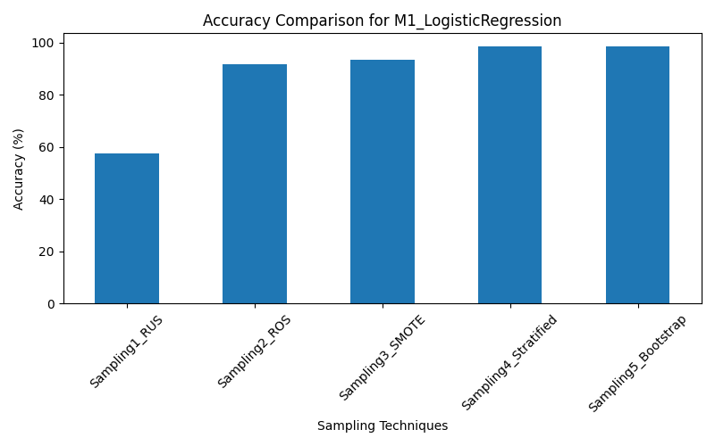
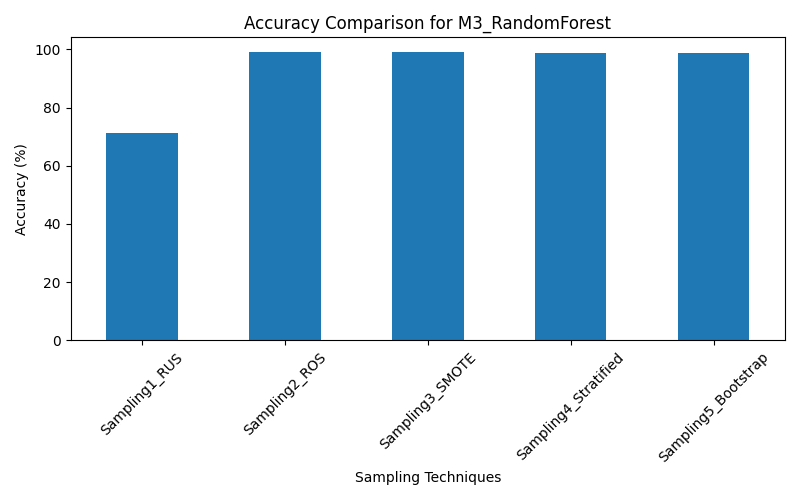
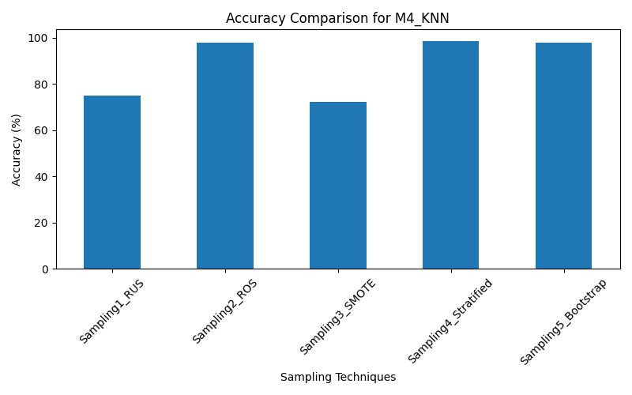
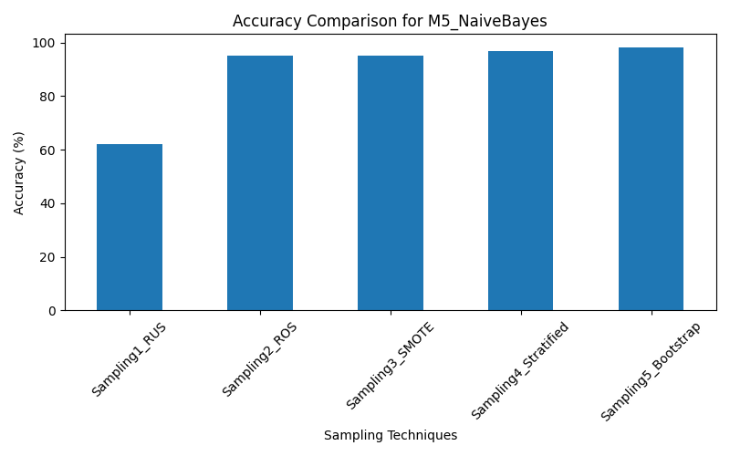
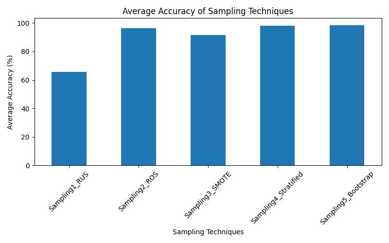

# Sampling Techniques for Imbalanced Dataset

## 📌 Objective
The objective of this assignment is to study the effect of different **sampling techniques** on a highly **imbalanced dataset** and analyze how these techniques influence the performance of various **machine learning models**.

Imbalanced datasets are very common in real-world problems such as **credit card fraud detection**, where fraudulent transactions are very rare compared to normal transactions.

---

## 📂 Dataset Description
- **Dataset Name:** Credit Card Dataset  
- **File:** `Creditcard_data.csv`  
- **Target Column:** `Class`
  - `0` → Normal Transaction  
  - `1` → Fraudulent Transaction  

The dataset is **highly imbalanced**, which can lead to biased machine learning models if not handled properly.

---

## ⚠️ Why Dataset Balancing is Required
In an imbalanced dataset:
- Models tend to predict only the majority class
- Minority class predictions become inaccurate
- Accuracy becomes misleading

Hence, **balancing the dataset is a crucial preprocessing step**.

---

## ⚖️ How the Dataset is Balanced
Balancing is achieved using **data-level sampling techniques** applied to the training dataset.  
Each technique modifies the class distribution in a different way.

### 🔹 Sampling Techniques Used
1. **Random Under Sampling**
   - Reduces majority class samples
   - Risk of information loss

2. **Random Over Sampling**
   - Duplicates minority class samples
   - May cause overfitting

3. **SMOTE (Synthetic Minority Over-sampling Technique)**
   - Generates synthetic minority samples
   - Improves generalization and performance

4. **Stratified Sampling**
   - Maintains original class proportions
   - Ensures fair train-test split

5. **Bootstrap Sampling**
   - Sampling with replacement
   - Useful for statistical stability

---

## 🤖 Machine Learning Models Used
Five different models were trained on each sampling technique:

| Model Code | Model Name |
|-----------|------------|
| M1 | Logistic Regression |
| M2 | Decision Tree |
| M3 | Random Forest |
| M4 | K-Nearest Neighbors (KNN) |
| M5 | Naive Bayes |

---

## 🧪 Experimental Procedure
1. Load and explore the imbalanced dataset  
2. Split data using stratified train-test split  
3. Apply five sampling techniques on training data  
4. Train five ML models on each sampled dataset  
5. Evaluate performance using **accuracy**  
6. Compare results using tables and graphs  

---

## 📈 Graphical Analysis

### 🔹 Logistic Regression Performance


---

### 🔹 Decision Tree Performance


---

### 🔹 Random Forest Performance


---

### 🔹 KNN Performance


---

### 🔹 Naive Bayes Performance


---

### ⭐ Overall Sampling Technique Comparison


---

## 📊 Graph Interpretation
- SMOTE and Bootstrap sampling consistently provide higher accuracy across most models
- Random Under Sampling shows reduced accuracy due to loss of majority class information
- Ensemble models like Random Forest benefit more from balanced datasets
- Graphs clearly demonstrate the importance of handling class imbalance

---

## 🏆 Conclusion
This project demonstrates that **handling class imbalance is essential** for building reliable machine learning models.  
Among all sampling techniques, **SMOTE and Bootstrap Sampling** provide the most consistent performance improvements across multiple models.

---

## ▶️ How to Run the Project

### 1️⃣ Install Required Libraries
```bash
pip install pandas numpy scikit-learn imbalanced-learn matplotlib

```
### 2️ Run the Python Script
python stats_sampling (1).py

### 3️⃣ Outputs Generated

Accuracy comparison table

Graphs saved as .png files

Visual comparison of sampling techniques


### 📁 Repository Structure
```
Sampling/
│
├── Creditcard_data.csv
├── stats_sampling (1).py
├── README.md
├── M1_LogisticRegression.png
├── M2_DecisionTree.png
├── M3_RandomForest.png
├── M4_KNN.png
├── M5_NaiveBayes.png
├── overall_sampling_performance.png
```

### 👨‍🎓 Author

Harshit Katyal
B.Tech | Data Science & Machine Learning
